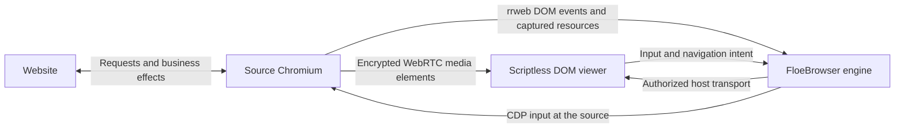

# FloeBrowser

A DOM-based remote browser engine. Websites execute in source Chromium; a remote client receives a live, inert DOM projection, source media streams, and sends input back to the source.

**Status: working DOM browser preview, not a general-purpose browser replacement.**


## Run locally

Requires Node.js 26 or later and the full Chromium build managed by the pinned Playwright release. No system Chrome, desktop environment, display server, or physical screen is required for headless operation. Linux still needs Chromium system libraries and fonts; provision those in the runtime image with `npx playwright install-deps chromium`.

```sh
npm ci
PLAYWRIGHT_SKIP_BROWSER_GC=1 npx playwright install chromium
npm run build
npm start -- --url https://example.com
```

Open the private viewer URL printed by the CLI. The source browser uses full Chromium in modern headless mode by default, rather than the separate Headless Shell. Its User-Agent keeps the real browser version and platform with the standard `Chrome` product token. This fixes sites that reject `HeadlessChrome` at document request time; it does not promise automation invisibility, CAPTCHA acceptance, or access from every network. Website requests, scripts, cookies, storage and form submissions remain in that browser.

Opening the same private URL in another window shows **This browser is open in another window**. Choose **Use in this window** to transfer control. The previous window disconnects with a persistent explanation; the source page, login and browser profile stay open. Opening or refreshing an inactive window never takes control automatically.

```sh
# Show the source browser while developing.
npm start -- --headed --url https://example.com

# Keep source login state in a dedicated, explicitly chosen profile.
npm start -- --profile /absolute/path/to/floebrowser-profile --port 8787
```

The default session uses a temporary browser context. Stop with Ctrl+C. Chromium's sandbox stays enabled; the CLI never uses `--no-sandbox`.

The CLI listens only on `127.0.0.1`. Its random private URL grants control of the source tab: keep it secret. It is not a public hosting service. For an SSH demo, forward the same port and open the printed URL on the client. This carries DOM, resources and control; audio/video also needs a reachable WebRTC path (see **Source media**):

```sh
ssh -N -L 8787:127.0.0.1:8787 user@source-host
```

A product integration should use its existing authenticated, encrypted transport and target-ownership system.

## What works

- Initial DOM snapshots and live mutations, stylesheets, input values and source scrolling.
- Source-loaded HTTP(S) images, CSS and fonts, including assets protected by source cookies. Responsive images use the source browser's selected image.
- Mouse input, double clicks, wheel scrolling, keyboard editing, text paste, Chinese IME composition, native selects and form submission.
- Native text-field focus and carets, synchronized to the source selection.
- Navigation, redirects, back, forward, reload, fit-to-window and actual-size viewing.
- Source tab creation, switching and closing, including links and scripts that open new windows.
- Same-origin and cross-origin iframe DOM, styles, images, nested input and frame navigation.
- Source video and audio, including capturable blob/MSE media and media inside cross-origin frames.
- Native selection and copying of text in the projected document.
- One active controller per page. Reconnection obtains a new snapshot and never resends commands.
- Scriptless replay, restricted viewer network access, bounded resources, message limits and stale-view rejection.

The application includes a standalone browser UI and reusable host, viewer and protocol exports. It does not depend on Redeven.

## How it works



rrweb records and reconstructs DOM state. FloeBrowser supplies the return input path, document generations, resource capture, projection sanitization and controller lifecycle.

The client runs trusted viewer code, but never the website's JavaScript. Website resources are read from Chromium's response buffer through CDP. There is no host HTTP fetch fallback, credential export, raw CDP endpoint, or screen capture. A separate encrypted WebRTC path carries captured source audio/video elements. The authorized host transport carries only media state and SDP signaling alongside DOM and input, so encoded video cannot fill the control queue.

DOM layout still happens on the client. Font availability, browser versions and CSS behavior can affect layout. This architecture does not promise pixel-identical rendering, lower bandwidth than video, or zero input latency.

## Source media

Media remains source-owned: the website obtains and decodes content at the source. `HTMLMediaElement.captureStream()` feeds individual audio/video tracks into `RTCPeerConnection`. The trusted viewer assigns the received `MediaStream` to the reconstructed element's `srcObject`. Source URLs, child `<source>` tags and rrweb playback commands cannot start client website requests. The replay sandbox still disallows website scripts.

Use the website's projected controls, or open **Media** for source play/pause and seeking. Playback starts muted on the client; choose **Enable sound** in that panel. The source's mute/volume settings also apply. Seeking changes the original element at the source. Capture and re-encoding add cost and latency; this is not a lossless relay.

Media travels over DTLS-SRTP independently of the DOM/control connection. Native WebRTC congestion control adapts to bandwidth and discards late frames instead of retaining an application queue of old video. Senders cap each video at 24 fps and 1.5 Mbit/s, scale source video wider than 1280 pixels down at capture start, and cap each audio track at 64 kbit/s. These are ceilings, not reserved bandwidth or guaranteed latency. A stalled video cannot fill the WebSocket ahead of clicks or DOM updates. Client CPU saturation and loss of the control connection can still affect interaction.

Capture runs only for the selected, controlled tab and closes on disconnect, handoff, tab switch, removed elements and changed source documents. DOM checkpoints preserve the existing media connection and rebind the received stream, including a paused frame. A new controller starts fresh media; no old media or input is replayed. At most eight media elements per source document are observed, and the host/viewer admit at most eight media nodes per tab. SDP messages are bounded to 48,000 characters and answers are fenced by controller, tab, view epoch, node and stream identity. Signaling runs separately from serialized source input; it does not authorize website actions.

The default ICE configuration uses direct connectivity with no public STUN or TURN dependency. Remote servers behind NAT or firewalls generally need a host-operated TURN relay. An SSH TCP tunnel alone does not carry the WebRTC stream. Supply the same host-owned configuration to the source and viewer through `AttachOptions.media`, `ProjectionServerOptions.media`, or the CLI:

```sh
npm start -- --media-config /private/path/media.json
```

Example `media.json` (replace with a reachable relay and short-lived credentials):

```json
{
  "iceServers": [
    {
      "urls": "turns:relay.example.com:443?transport=tcp",
      "username": "temporary-session-user",
      "credential": "temporary-session-credential"
    }
  ],
  "iceTransportPolicy": "relay"
}
```

Relay configuration and credentials are delivered to the authorized viewer and injected into source documents. Use scoped, short-lived credentials rather than long-lived server secrets. The embedding host owns relay availability, authorization and network policy. Direct mode can expose ICE network addresses to the peer; use relay-only mode when that is inappropriate. The standalone viewer is served on a trustworthy loopback origin; remote product viewers should use HTTPS and support WebRTC.

DRM-protected media is refused explicitly. Origin-restricted streams, unsupported codecs, source autoplay restrictions, inaccessible media elements, and client browser limitations can prevent playback. Qualify native WebRTC media in the actual Desktop webview, especially on platforms using WebKit. Canvas, tab/display capture, camera and microphone capture are not used.

External qualification on the development Mac verified X's public homepage and YouTube's public “Me at the zoo” video using managed headless Chromium. The YouTube viewer decoded video and an audio track without requesting the website. These observations do not certify login flows, every video, other operating systems, or future site policies.

## Embed the engine

The public package name is `@floegence/floebrowser`. Version `0.1.0` in this repository is not automatically an npm release.

```ts
import { BrowserProjection, launchSourceBrowser } from '@floegence/floebrowser';

// Optional helper. Hosts may also supply their own Chromium page.
const context = await launchSourceBrowser({
  profile: '/path/to/source-profile',
});
const page = await context.newPage();

// Attach before navigation so source resource responses can be captured.
const projection = await BrowserProjection.attach(page, {
  authorize: (action) => hostAllowsCurrentUser(action),
  resourceURL: (id) => hostAuthorizedResourceURL(id),
});
await page.goto('https://example.com');

// The embedding product must authenticate this viewer and acquire an exclusive
// target-control lease before admitting a controller.
const controller = await projection.connect((message) =>
  transport.send(message),
);
transport.onMessage((message) => controller.receive(message));

// Serve only opaque IDs through an authenticated, same-origin resource route.
const resource = await projection.resources.read(requestedResourceID);
// If present, respond with resource.body and resource.type; otherwise return 404.

// Stop admission, drain submitted work and release pressed inputs before
// releasing the product's target-control lease.
await controller.close();
await projection.close();
// The page, context and browser are still owned by the embedding host.
await context.close();
```

`authorize` is checked immediately before an effect. It is not a target mutex or a site-navigation firewall. The host must preserve its existing tab ownership, network policies, origin grants and user/AI takeover rules for the controller's entire lifetime. Attaching does not authorize sibling tabs. Page-originated navigation, redirects and popups remain website behavior at the source.

For a standalone loopback carrier:

```ts
import { createProjectionServer } from '@floegence/floebrowser';

const server = await createProjectionServer(page, {
  port: 8787,
  authorize: () => true, // Appropriate only for this private, fully trusted demo.
});
console.log(server.url);
// Later: await server.close(); The source page is not closed.
```

## Own a source browser session

`BrowserSession.attach(initialPage, options)` adds tab management above `BrowserProjection`. It owns the initial page, descendant popups and pages explicitly created through `tab_new`; it does not adopt other pages in the same browser context. The embedding product must authorize that session scope. `connect`, `hasController` and `close` follow the same exclusive-controller lifecycle as the page engine. Detaching the session does not close host-owned pages or the browser context.

The standalone server uses this session API. Source popups become the selected tab. The tab strip supports creation, switching, closing and arrow-key navigation. Closing the last source tab creates a blank one. Existing source DOM, history and credentials survive tab switches. `tab_new`, `tab_select` and `tab_close` go through `authorize` before their effects. `tabs` messages carry the tab list and active ID; the viewer exposes these through `onTabs`. Every command must include the active tab's `BrowserState.id` as `tab`. Old-tab commands and duplicate command IDs are rejected; they are never redirected to another page.

Cross-origin frame recording uses rrweb's published cross-origin mirror API, with a source recorder in each cross-origin frame root. Chromium frame sessions supply observed response bodies; source node IDs are resolved through the frame mirrors, and input is dispatched at the corresponding source coordinates after hit-testing each containing frame. Nested client frames have `sandbox="allow-same-origin"`, no source URL, no website scripts and no client-side form submission. Frame navigation updates its document without replacing the main projection. Reconnection requests new main and child snapshots.

## Embed the viewer

```ts
import { DOMBrowserView } from '@floegence/floebrowser/viewer';
import '@floegence/floebrowser/viewer.css';
import type { ProjectionConnection } from '@floegence/floebrowser/protocol';

// Implement send, subscribe, onDisconnect and close over the host's carrier.
const connection: ProjectionConnection = hostProjectionConnection;
const view = new DOMBrowserView(container, connection, {
  onState: (state) => updateBrowserChrome(state),
  onNotice: (message) => showNotice(message),
  onStatus: (status) => updateConnectionState(status),
  onAddressFocus: () => focusAddressField(),
});

await view.dispatch({ kind: 'navigate', url: 'https://example.com' });
view.setFit(true);
// Later: view.destroy();
```

Give `container` a constrained width and height. The viewer uses a sandboxed, scriptless iframe that the trusted parent can inspect for node mapping. An embedding host must preserve the same restrictions as the standalone carrier: no target-site network access, no form submission, no plugins, and no website access to a native bridge. Resource URLs must resolve through a protected host route permitted by the viewer's CSP. The loopback server's CSP is the reference policy in `src/host/server.ts`.

Use the same FloeBrowser release on both sides. Protocol version 4 includes the pinned rrweb event format; it is not a promise of compatibility with independently upgraded rrweb packages.

## State and failure boundaries

The source page is authoritative. A full snapshot creates a new opaque view epoch. Input carries that epoch, the source tab ID and a monotonically increasing command ID. A command from a previously selected tab is rejected, including navigation commands. Source node references are resolved and hit-tested just before dispatch. The engine rejects stale epochs, duplicate IDs, disconnected controllers and unauthorized effects.

The host serializes commands. Disconnect discards unstarted commands, drains started work, and releases held input outside the source viewport. It does not undo completed effects. Cleanup failure prevents admitting another controller to that engine. A missing acknowledgement never causes a retry. Reconnection creates a fresh current view; it is not an action replay.

The standalone loopback carrier serializes viewer admission. Its explicit handoff closes and drains its previous controller before admitting the next one; it does not replace controllers owned outside that carrier. The private session URL and exact Host/Origin checks still apply to handoff requests. `webSocketConnection` passes optional `DisconnectReason` values (`viewer_in_use`, `viewer_replaced`, `source_unavailable`) through `ProjectionConnection.onDisconnect` and the viewer's `onStatus` callback so hosts can render persistent recovery actions. Product integrations retain ownership of their own target leases and handoff policy.

The viewer detects missing event sequences and requests a fresh snapshot. It also checkpoints after 4,000 incremental messages or 8 MiB of event text to bound rrweb replay history. This is a view refresh, not transport recovery. The embedding transport owns disconnect detection.

Each Chromium page or out-of-process frame session uses an 8 MiB per-resource response buffer and a 64 MiB total response buffer. Each tab shares one host resource cache across its frames, retaining at most 64 MiB and 2,048 opaque resource records, evicting least recently used records. Assets outside these limits or unavailable from the observed browser responses return an explicit unavailable response. Resources are never refetched by a separate HTTP client. DOM messages are limited to 16 MiB, control messages to 64 KiB, text insertion to 16,000 characters, and queued commands to 64 per controller.

Projection data remains in process memory; there is no session recording database or replay log. DOM and typed text can contain sensitive information. The library must not be connected to model history or general application logging as a substitute for a private viewer channel. Password inputs retain rrweb's masking behavior; this is not a general sensitive-content detection system.

## Current limits

| Surface                                                      | Preview behavior                                                                                                                                        |
| ------------------------------------------------------------ | ------------------------------------------------------------------------------------------------------------------------------------------------------- |
| Browser                                                      | Multiple source tabs and one active controlling viewer per session                                                                                      |
| Canvas, embeds, file inputs                                  | Explicit unavailable placeholders; no pixel fallback                                                                                                    |
| Video and audio                                              | Source element capture over encrypted WebRTC; adaptive real-time playback; no screen capture                                                            |
| Frames                                                       | Same-origin, cross-origin and nested iframe DOM; no client website execution                                                                            |
| New tabs                                                     | Initial page, its descendant popups, and explicitly created tabs; unrelated pages remain outside the session                                            |
| CAPTCHA                                                      | DOM-based widgets can be shown and operated by the user; site acceptance, image challenges and anti-automation compatibility require site qualification |
| Native dialogs                                               | Dismissed at the source with a notice; no automatic acceptance                                                                                          |
| Downloads                                                    | Started at the source with a notice; no file-transfer UI                                                                                                |
| Clipboard                                                    | Text paste and copying projected text; no source OS clipboard synchronization                                                                           |
| Existing loaded pages                                        | Reload at the source to capture resources loaded before attachment                                                                                      |
| Closed shadow roots, DRM, WebAuthn, browser chrome, DevTools | Not supported or qualified                                                                                                                              |
| Arbitrary rich editors, custom drag-and-drop, CSS edge cases | Require site-specific compatibility qualification                                                                                                       |

The included real-browser tests verify the declared fixture flows. They do not certify every website or every operating system. Native scrollbar interaction in the projected document is suppressed; scrolling is forwarded through wheel and keyboard input to preserve source ownership.

## Development and verification

```sh
npm run check
npm run format:check
npm test
npm run build
npm run test:e2e
npm run check:package
```

Browser tests create isolated contexts and local fixture servers. The client is blocked from accessing the fixture website. Tests cover authenticated images/CSS/fonts, trusted source clicks, IME, submission cookies, responsive images, live DOM changes, navigation, scrolling, scaling, selection, reconnect, stale epochs, duplicate commands, authorization, controller revocation, source tabs, stale-tab rejection, cross-site nested frames and source-only frame resources, managed headless profiles, blob and cross-origin MSE video/audio decoding, media source replacement, source playback/seek authorization, media teardown and recovery, media signaling fences, dropped RTP packets with responsive input, and paused-frame preservation across DOM checkpoints.

`npm run test:e2e` requires a current build and Playwright Chromium. Test screenshots are written to `.test-artifacts/`. The package check installs the packed tarball into an isolated temporary directory and runs the viewer without source-checkout paths. Unit tests need no browser. Ordinary CI runs formatting, type and unit checks; real-browser qualification is available by manual workflow dispatch.

## Ownership and integration

FloeBrowser owns reusable projection, source input mapping, the wire protocol and viewer. Redeven should own environment authentication, target leases, browser/profile lifecycle, transport and product UI. Redeven integration is a separate change and should consume a released FloeBrowser artifact.

## License

MIT. rrweb and other upstream notices are listed in [THIRD_PARTY_NOTICES.md](THIRD_PARTY_NOTICES.md).
