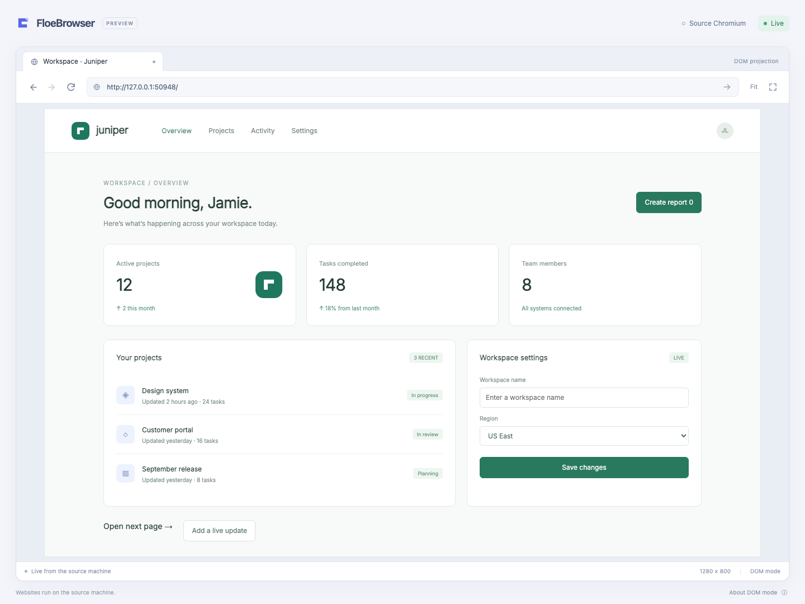
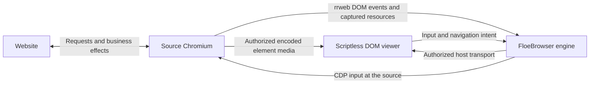

# FloeBrowser

A DOM-based remote browser engine. Websites execute in source Chromium; a remote client receives a live, inert DOM projection, source media and Canvas frames, and sends input back to the source.

**Status: working DOM browser preview, not a general-purpose browser replacement.**



## Run locally

Requires Node.js 26 or later and the full Chromium build managed by the pinned Playwright release. No system Chrome, desktop environment, display server, or physical screen is required for headless operation. Linux still needs Chromium system libraries and fonts; provision those in the runtime image with `npx playwright install-deps chromium`.

```sh
npm ci
PLAYWRIGHT_SKIP_BROWSER_GC=1 npx playwright install chromium
npm run build
npm start -- --url https://example.com
```

Open the private viewer URL printed by the CLI. The source browser uses full Chromium in modern headless mode by default, rather than the separate Headless Shell. Its User-Agent keeps the real browser version and platform with the standard `Chrome` product token. Chromium startup settings also disable the explicit WebDriver automation marker. These settings improve site and media-session compatibility; they do not promise automation invisibility, CAPTCHA acceptance, or access from every network. Website requests, scripts, cookies, storage and form submissions remain in that browser.

Opening the same private URL in another window shows **This browser is open in another window**. Choose **Use in this window** to transfer control. The previous window disconnects with a persistent explanation; the source page, login and browser profile stay open. Opening or refreshing an inactive window never takes control automatically.

```sh
# Show the source browser while developing.
npm start -- --headed --url https://example.com

# Keep source login state in a dedicated, explicitly chosen profile.
npm start -- --profile /absolute/path/to/floebrowser-profile --port 8787
```

The default session uses a temporary browser context. Stop with Ctrl+C. Chromium's sandbox stays enabled; the CLI never uses `--no-sandbox`.

The CLI listens only on `127.0.0.1`. Its random private URL grants control of the source tab: keep it secret. It is not a public hosting service. For an SSH demo, forward the same port and open the printed URL on the client. This carries DOM, resources, control and the independently scheduled media connection:

```sh
ssh -N -L 8787:127.0.0.1:8787 user@source-host
```

A product integration should use its existing authenticated, encrypted transport and target-ownership system.

## What works

- Initial DOM snapshots and live mutations, stylesheets, input values and source scrolling.
- Source-loaded HTTP(S) images, CSS and fonts, including assets protected by source cookies. Responsive images use the source browser's selected image.
- Mouse input, double clicks, wheel scrolling, keyboard editing, text paste, Chinese IME composition, native selects and form submission.
- Native text-field focus and carets, synchronized to the source selection.
- Navigation, redirects, back, forward, reload, automatic source viewport sizing, fit-to-window and actual-size viewing.
- Source tab creation, switching, drag reordering and closing, including links and scripts that open new windows.
- Same-origin and cross-origin iframe DOM, styles, images, nested input and frame navigation.
- Source video and audio, including capturable blob/MSE media and media inside cross-origin frames.
- Canvas 2D and WebGL/WebGL2 graphics with source pointer, drag, wheel and keyboard input.
- Native selection and copying of text in the projected document.
- One active controller per page. Reconnection obtains a new snapshot and never resends commands.
- Scriptless replay, restricted viewer network access, bounded resources, message limits and stale-view rejection.

The application includes a standalone browser UI and reusable host, viewer and protocol exports. It does not depend on Redeven.

## How it works



rrweb records and reconstructs DOM state. FloeBrowser supplies the return input path, document generations, resource capture, projection sanitization and controller lifecycle.

The shared source adapter observes top-document titles in an isolated world, independently of projection. Background title changes update the browser directory without starting DOM recording or media capture. Disposal removes the observer and its binding while leaving the website and host debugger usable.

The client runs trusted viewer code, but never the website's JavaScript. Website resources are read from Chromium's response buffer and the inspected document's resource cache through CDP. There is no host HTTP fetch fallback, credential export, raw CDP endpoint, or screen capture. A source-host-only loopback collector receives captured element media. Encoded video, Opus audio and Canvas images use independently scheduled host-authorized byte streams; SDP stays on the source host. The viewer has no WebRTC connection. Redeven integrations carry every cross-host lane through Flowersec.

When attaching to an existing page or a fast-loading popup, resource capture also inspects the source frame tree and reads retained stylesheets, images and fonts. Document load completion revisits resources that were still loading during attachment. These reads run outside the input queue, use the same bounded per-tab cache as network capture, and cannot overwrite a newer captured response or survive navigation or detachment. Only URLs observed in that source page and its frames are eligible; resource caches are not shared between tabs. Chromium may already have discarded a body, particularly a decoded font, in which case it remains unavailable.

Stylesheet rewriting uses a tolerant CSS parser so malformed declarations do not discard the surrounding rules. CSS escapes, imports, `url()` and string candidates in `image-set()` resolve through captured source resources. CSSOM insertion, declaration edits and whole-sheet replacement use the source stylesheet or frame base URL. Constructed sheets retain this behavior inside open shadow roots and cross-origin frames.

Source stylesheet links use a stable projected style node so preloading, activation, URL replacement, link media attributes and disabled state do not leave stale rules behind. Style text changes replace the sheet content; CSSOM rule edits retain their ordered incremental path. Disabling a constructed sheet suppresses its projected rules while source edits continue, and enabling it restores the current source rules. The recorder observes the native disabled setter without changing its result and restores that observer on detach.

Selectors keep their source meaning when replay must make an attribute inert. Original `href`, `src`, `srcset`, `sizes`, `poster`, `background`, `xlink:href` and `contenteditable` values are retained in reserved data attributes for selector matching. The active URL or editing attribute is still sanitized separately. Link pseudo-classes, URL attribute selectors and the `link`/`style` tag distinction are rewritten with the original specificity, including nested selectors. Source-provided reserved markers are discarded; this does not enable viewer-side navigation or expose browser visit history.

SVG style text updates retain their SVG namespace. MathML elements are rebuilt in the native MathML namespace, preserving fractions, exponents and live node identities. Site-defined scrollbar gutters and scrollbar widths are retained instead of being forced to zero.

DOM layout still happens on the client. Font availability, browser versions and CSS behavior can affect layout. This architecture does not promise pixel-identical rendering, lower bandwidth than video, or zero input latency.

The viewer retains up to three recently completed inert tab documents in memory.
Selecting a cached tab shows it immediately while fresh source selection and input
authority are pending. Cached pages never receive input or new source updates;
only a fully rebuilt current view becomes interactive. Source removal, changed
URLs, revoked directory grants and disconnect discard corresponding caches.
State-preserving DOM moves retain iframe documents and loaded resources. Browsers
without that API rebuild normally and do not advertise a cached presentation.

## Source media

Media remains source-owned: the website obtains and decodes content at the source. Existing `srcObject` media streams are borrowed directly and their tracks are cloned; other elements use `HTMLMediaElement.captureStream()`. These individual tracks are sent to the Go `media` module's Pion collector on the same host. It binds only `127.0.0.1`, advertises only loopback candidates, uses ICE-lite, and has no STUN/TURN configuration. The optional Node adapter uses the packaged native helper; embedding Go hosts can use the collector directly. The helper uses standard input for requests, standard error for structured replies, and standard output for binary media; it has no inherited descriptor-number requirement or diagnostic output. The SDK verifies the packaged native artifact checksum and negotiates matching SDK/media wire versions before accepting a collector. Neither route captures a display, tab, camera or microphone.

The collector emits bounded packets containing target, subscription, element, stream, track, timestamp, codec and keyframe identity. RTP assembly retains up to 2,048 packets so detailed keyframes fit before depacketization; its 100 ms timestamp window and 20 ms idle flush after a complete frame remain independent of that size bound. The collector maps audio and video RTP clocks onto one source timeline. Workers and playback preserve that relative timing; a late first video frame must not reset its timestamp to the first audio frame. Device-clock sampling starts only after the worklet has consumed its first samples, avoiding a synchronous native latency query during audio startup. Presentation checks compare displayed flashes with audible pulses at the audio device clock, including initial video loss. The synchronized fixture in `test/fixtures/av-sync.webm` is regenerated by `node scripts/generate-sync-fixture.mjs` with ffmpeg. The remote viewer receives encoded bytes through `ProjectionConnection.subscribeMedia`, decodes video and Opus in Workers using WebCodecs, and schedules PCM through AudioWorklet. Canvas uses complete WebP element images. The client never needs source website access or a route to the collection port. Resource and replay restrictions remain unchanged.

`AttachOptions.mediaBridge` supplies the source-local collector. `onMediaFrame` delivers encoded packets to an independently authorized carrier and `onMediaRetired` retires its queued lanes. `MediaSender` provides bounded per-track queues, fair scheduling, 16 KiB writes and a finite consumer-credit window. A carrier returns cumulative byte acknowledgements after each chunk is consumed by its bounded packet reader and any completed frames are delivered. The 64 KiB outstanding-byte limit applies within large frames too; complete-frame acknowledgements must not be used. Video reference loss requests a fresh keyframe instead of decoding dependent deltas. Canvas retains its newest complete image; DOM increments retain their ordered path and use checkpoints for recovery. Reliable transport still incurs network retransmission latency.

Use the website's projected playback controls as usual. Optional **Media controls** in the browser toolbar provide source play/pause, per-player mute and seeking in a compact panel with media titles, playback state, icon controls and an elapsed/duration timeline; the popup opens only on request, closes with Escape or a click outside, and never opens itself on media errors. Hidden idle media does not surface controls or failure notices, while playing background audio remains controllable. The viewer follows source mute/volume settings and attempts normal audio playback. If the client browser blocks autoplay, video continues muted and the next page click or key press attempts to unlock audio; **Unmute audio** is also available in the toolbar popup. An explicit client mute is preserved across page gestures. Each player’s mute button separately changes that real source element under its current control lease; it neither starts playback nor changes another player. Its pressed state follows source events, including changes made by a local user. The panel’s top-level sound control affects only this viewing window. The panel reflects source playback, including website autoplay; opening it never starts source media. Muted playback is labeled explicitly. **Show on page** scrolls the source to the corresponding visible player, including nested scroll containers and cross-origin frames, then briefly highlights its projection. Locating never clicks, focuses, plays or seeks the media. Audio without a visible player remains controllable and is labeled accordingly. Seeking changes the original element at the source. A play acknowledgement confirms that the source received the request; playback state and errors arrive independently, so buffering never holds the input queue. Capture and re-encoding add cost and latency; this is not a lossless relay.

Source senders cap each video at 24 fps and 1.5 Mbit/s, scale source video wider than 1280 pixels down at capture start, and cap audio at 64 kbit/s. These are ceilings, not bandwidth or latency guarantees. A slow consumer has at most eight in-flight packets and a 64 KiB outstanding-byte window that also bounds partial frames; queued media has a separate 4 MiB hard bound. Queued video older than 250 ms is discarded with its dependents. Workers bound encoded decode work, retain at most one pending decoded picture, and bound unconsumed PCM to 12,000 samples per channel. Static Canvas retains one latest complete image.

DOM removal retires media by stream identity, so reinserting an element establishes a fresh stream. Replacing a source document retires its old streams; DOM checkpoints preserve valid streams and paused pictures. Page-owned `srcObject` tracks are cloned before forwarding and are never stopped by projection teardown. Recapturing a stream-backed element is avoided because Chromium can replace its original Canvas track wrapper and stop the website’s producer when that wrapper is collected. Media subscription generations are separate from DOM epochs. Decoder keyframe feedback is fenced by current viewer, target, subscription and stream identity; it cannot carry SDP or authorize website actions. At most eight media/Canvas nodes per tab are admitted.

The standalone loopback server creates a second private WebSocket for encoded media and consumer acknowledgements. Its token belongs to the admitted viewer and expires with that viewer; it does not transfer control authority. An SSH TCP tunnel carries both connections. Product integrations supply authenticated byte streams and HTTPS client origins supporting WebCodecs, Workers and AudioWorklet. DRM, origin restrictions, source autoplay policy, unsupported codecs and client platform support can still prevent playback; these cases are explicit rather than replaced with screen capture.

Decoder failures are scoped to a single element track. A damaged video packet
requests a fresh keyframe; a damaged Opus packet can recover from the next
packet. Three consecutive decoding failures retire that track until a fresh
media subscription, while a successfully decoded frame renews the recovery
budget. Missing or unsupported platform codecs retire their track immediately
and report unavailability once. Audio and video fail independently; a broken
video decoder cannot stop healthy audio or flood the control carrier with
keyframe requests.

## Source Canvas graphics

Canvas 2D and WebGL/WebGL2 images reach the source-local collector through an element data channel, then use the authorized binary carrier. The source observes native render completion and retains only the current bitmap of up to eight visible canvases per document, downscaled to a maximum 1280-pixel edge. This bounded source-local cache is necessary because WebGL normally discards its drawing buffer after presentation. It is not a recording, is never persisted, and cannot send data without an authorized media observation. Native drawing methods keep their arguments, return values and exceptions; source context options and render scheduling are not changed. Website Canvas commands and JavaScript never execute in the viewer; rrweb Canvas recording and unsafe Canvas replay remain disabled.

Only tabs with an authorized visible observation encode and forward Canvas frames. Each sender has one encoder operation and one bounded frame in transport, with an approximately 24-fps ceiling. WebP preserves alpha. Images use 16-KiB chunks on an unordered channel with no packet retransmission; the receiver discards incomplete older frames when newer ones arrive. Each encoded image is capped at 1 MiB. An unchanged current frame is offered once per second so packet loss does not permanently blank a static scene. Pixels never enter the DOM/control carrier. Canvas uses the same target, subscription, node and stream fences as audio/video; endpoints close, new encoding stops, and pending encoded results are discarded on media revocation and removal. Hidden observations stop image encoding and receive no picture frames, while source-local current bitmaps remain bounded. Source-local current state can update as the source website renders, including while another tab is selected, and is released on document removal or engine detach.

The viewer displays an inert image with source intrinsic dimensions, preserving Canvas selectors, attribute selectors, CSS sizing, transparency, hidden overlays and zero-sized surfaces. Image delivery cannot change layout ahead of the authoritative DOM size. Canvas does not show video playback or seek controls. Pointer, wheel and keyboard actions go through the existing fenced source input path. Rapid drag moves are not discarded by the idle-hover throttle. Ordinary printable keys use native source key events, so editor shortcuts and the source page's `preventDefault()` behavior work; IME and paste retain the text insertion path. Reconnection and tab selection use the current source bitmap without rerunning input or forcing a website redraw.

Qualification covers static and changing Canvas 2D/WebGL2, transparency, resizing, checkpoint/reconnect/tab-switch recovery, DOM removal, source input during delayed encoding, cross-origin frame redraws, and bounded unordered frame assembly. The public three.js editor was exercised with object selection, view rotation, zoom and transform-axis dragging. These checks do not certify all graphics APIs. WebGPU, worker/OffscreenCanvas rendering, protected or origin-tainted canvases and unobserved extension-specific render paths are not supported or qualified. Unsupported contexts and origin restrictions show an unavailable surface. If attachment occurs after a WebGL render has already been discarded—including an initial out-of-process iframe render—the image must wait for the site's next observed render; it cannot be recovered from DOM. Graphics copying, encoding, decoding and shared machine resource exhaustion can still add latency.

## Embed the engine

The public package name is `@floegence/floebrowser`. A version in this repository is not automatically an npm release.

```ts
import { BrowserProjection, launchSourceBrowser } from '@floegence/floebrowser';

// Optional helper. Hosts may also supply their own Chromium page.
const context = await launchSourceBrowser({
  profile: '/path/to/source-profile',
});
const page = await context.newPage();

// Prefer attaching before navigation to retain all source response bodies.
// Already-loaded pages also recover resources retained by Chromium.
const projection = await BrowserProjection.attach(page, {
  authorize: (action) => hostAllowsCurrentUser(action),
  resourceURL: (id) => hostAuthorizedResourceURL(id),
});
await page.goto('https://example.com');

// The embedding product must authenticate this viewer and acquire an exclusive
// target-control lease before admitting a controller.
const controller = await projection.connect((message) =>
  transport.send(message),
);
transport.onMessage((message) => controller.receive(message));

// Serve only opaque IDs through an authenticated, same-origin resource route.
const resource = await projection.resources.read(requestedResourceID);
// If present, respond with resource.body and resource.type; otherwise return 404.

// Stop admission, drain submitted work and release pressed inputs before
// releasing the product's target-control lease.
await controller.close();
await projection.close();
// The page, context and browser are still owned by the embedding host.
await context.close();
```

Resource references on the wire are inert, host-scoped identities. Source capture
announces available response bodies and their revisions; the trusted viewer
fetches only those same-origin host URLs and supplies Blob URLs to the scriptless
replay. This also works when replay-frame HTTP would bypass a host's Service
Worker. `ViewOptions.fetchResource(url, signal)` can supply a host-owned resource
reader. CSS imports, fonts, SVG references and later CSSOM updates share this
path. Unused or unavailable fonts never trigger a website request or hold first
paint; fonts retain the 200 ms fallback budget. Resource reads run independently
of DOM/input, with eight concurrent reads, a 512-entry wait queue, 2,048 cached
identities, 8 MiB per body, a 64 MiB retained/read budget and ten-second read
deadlines. Rebuilding or retiring a replay aborts reads and revokes its blobs.

`authorize` is checked immediately before an effect. It is not a target mutex or a site-navigation firewall. The host must preserve its existing tab ownership, network policies, origin grants and user/AI takeover rules for the controller's entire lifetime. Attaching does not authorize sibling tabs. Page-originated navigation, redirects and popups remain website behavior at the source.

Hosts can construct `new NativeMediaBridge()` from the public package to use its
bundled media collector. The SDK resolves the current platform's helper and
verifies its release version, size and SHA-256 before starting it; hosts do not
need private package paths or a helper on `PATH`. Pass this bridge as
`mediaBridge` and forward its encoded frames through the host's authorized
media carrier. The host must close the bridge when its owning session ends.

`BrowserProjection.observe(send, options)` creates a viewing grant without input authority. `acquireControl(observation, authorize)` creates the page's sole input handle only after host authorization; it never steals another handle. Releasing input leaves authorized DOM and media observation alive. Closing an observation revokes its input handle and media delivery synchronously, then drains held input. Each observation has a separate media subscription generation; disabling its media with `setMedia(false)` sends `media_end`, retires queued packets, and leaves other viewers and input unaffected. Multiple viewers share one source element collector. The source stops collection when the last media subscription ends. `setVisible(false)` immediately revokes that observation's input, suppresses its DOM and picture delivery, and preserves its authorized audio. With no visible observation, source DOM emission stops and video sender encodings become inactive; website execution and playback continue. Returning requests a new DOM snapshot and independent video keyframe without recreating the audio collector.

`BrowserSession.observe(send, options)` opens an independent browser view. Its
connection owns its selected tab, admission queue and observation grants;
selection in one window does not change another window or an AI target. A fresh
observer cannot mutate pages, resize the source or edit the tab directory.
`acquireControl(authorize, canControl?)` is a trusted host API that attempts
the selected page's exclusive input lease. It never grants directory editing. Without a predicate, the grant is limited to the page selected at that
call; switching or creating a tab does not extend input authority. Embedded
hosts pass a synchronous `canControl(page)` predicate backed by their target
leases. It is checked before acquisition and again before input dispatch,
including after asynchronous action authorization. Call `refreshGrants()` when
it changes to revoke input synchronously and drain held keys. Observation and
authorized directory operations remain available. The method returns false if
the predicate denies the page or another controller owns it, without stealing
control. `setDirectoryAuthority(authorize)` grants directory editing separately;
calling it without an authorizer revokes that grant, including pending asynchronous
authorization. Watching permits selecting an already observed page; an installed
directory authorizer may further restrict selection. The component reflects the
directory grant independently from page control. Releasing
page input does not revoke directory editing. Standalone `connect()` explicitly
grants both its own directory operations and page input.
`releaseControl()` revokes authority synchronously and drains held input while
leaving observation alive. Hosts complete their own takeover policy before
acquiring again. `projection(target)` gives trusted AI adapters the same
projection and debugger owner, without itself granting observation or control.

A view's `canObserve(page)` predicate limits its page directory and media; call
`refreshGrants()` immediately whenever this host permission changes. Removed
observations are revoked before asynchronous cleanup. Use the connection's
`readResource(target, resourceID)` for view-scoped resource delivery: it verifies
both the initial grant and the same observation after the asynchronous read.
Source callbacks, resource replies and media are not sent for removed grants.
Private takeover must revoke other user/model views through these host grants;
it is not a physical keyboard lock on the original personal browser.

`audio: false` observes pictures without receiving audio packets. A session's
`canHear(page)` predicate additionally assigns audio output per source, so different
windows may own different background pages. Call `refreshGrants()` on the old owner
before the new one after changing ownership; every delivered audio frame rechecks
the predicate. `setAudio(false)` mutes all authorized source audio for that view. This advances the observation's media permission generation and
retires queued decoders, while keeping source collectors and playback alive.
This policy is independent of the page's actual mute state and input ownership.
Observers fit the authoritative viewport and cannot race its controller's size.
`closeCDPPage(page, transport)` supplies the shared source-scoped native close
lifecycle for host adapters: it waits for physical page closure or a declined
`beforeunload` decision without closing the surrounding browser context. Hosts
expose it only for an explicitly authorized page.

Hosts with asynchronous input leases can provide `onRequestControl(target, signal)`
to admit a submitted address only after the idle-control token is ready. This
callback must not take over another controller. Tab changes, a newer submission,
disconnection and destruction cancel unsubmitted navigation; no input is replayed.

The component exposes `onTakeControl` for a product-owned takeover action; no
remote input message can manufacture this grant.

The standalone `BrowserSession.connect` returns a `SessionConnection` that controls its observation's media lifetime independently. The carrier admits DOM and control first, enables media only after its separate authorized socket connects, and suspends capture when that socket closes. A media failure cannot revoke browser input. The session retains visited tabs' authorized background audio observations across selection, without sending background DOM or pictures. Media states name their source target, and the viewer keys playback by target and stream, independently of DOM epochs. The media panel offers **Open tab** for a background source; locating it does not start playback. Closing its source tab or the viewing session retires its decoders. `BrowserProjection.connect` remains the convenience API for hosts that grant viewing and input together.

Source loading is distinct from DOM readiness. The reload control becomes
**Stop loading** while Chromium reports a load, and Escape from the page stops
it. Stop is an authorized cancellation: it can interrupt the pending navigation
wait while later input remains ordered behind both operations. Intentional
cancellation preserves the current document and does not display a navigation
failure. A navigation deadline includes waiting for the initial CDP response,
not only the eventual document event.
Chromium network-error documents are not replayed as website DOM. Selecting or
reconnecting a failed tab keeps the original failed address and error state;
only explicit navigation or reload requests the site again.

Website alerts, confirmations, prompts and beforeunload decisions use page-local
browser chrome. Only the current controller receives the dialog, with a fresh
opaque identity; observers receive neither its text nor reply authority. Replies
remain host-authorized and can release a blocked input/navigation command. The
viewer pauses action deadlines while Chromium waits for the user's decision.
Switching tabs, disconnecting or revoking control cancels the old dialog without
accepting it; old identities and responses are never reused. Cancelling
beforeunload preserves the source page and directory entry. Confirming closes only
that page. Hosts with an existing AI/native-dialog owner supply
`onUncontrolledDialog` for dialogs without a projection controller; otherwise
unattended dialogs are dismissed. The low-level view exposes `onDialog`, and
`mountBrowser` supplies the localized, keyboard-accessible dialog surface.

**Find in page** (Control/Command+F) uses Chromium's native text matching,
selection and scrolling at the source, including authorized child frames. Enter
and Shift+Enter move forward and backward with wrapping; Escape closes the find
bar. The viewer mirrors the resulting selection without moving focus away from
the query. Search text is not sent to a search service or indexed in a host-side
copy of the document. Find is an input operation and requires the current control
lease. Switching tabs cancels an unsent query and closes its find surface.

Page zoom is per source target and survives viewer reconnection and tab switches.
The toolbar and Control/Command with +, − and 0 control it. Zoom changes the source
CSS viewport and raster density together, then the viewer scales that projection
to the control window. Responsive layouts, resolution media queries, Canvas and
input coordinates therefore use the same source geometry; no `style.zoom` or
website stylesheet is changed. Source adapters implement both arguments of
`setViewportSize(size, deviceScaleFactor)` as one viewport operation. Zoom ranges
from 25% to 500%, within the existing 8192-pixel CSS viewport limit. New unsent
zoom choices coalesce, while rejected or uncertain operations are not repeated.

File inputs use Chromium's native file-chooser events, including hidden controls
opened by page JavaScript, cross-origin frames and directory selection. Only the
current controller receives `file_chooser`; observers receive no chooser or
upload identifiers. `mountBrowser` offers a local picker with source origin,
cancel and transfer progress. Web clients require a new local gesture to open
that picker after the remote request arrives.

Desktop hosts can supply `BrowserOptions.chooseFiles(request, { signal,
progress })` to open their system picker immediately, without an extra web
gesture. This trusted callback streams the chosen files through the host's
authenticated upload service and returns the resulting opaque upload IDs (or
`null` on cancellation). It never returns client or source filesystem paths.
The host must bind selection and staging to the supplied target/chooser and
honor `signal` by closing native UI and aborting transfers. Navigation, takeover,
disconnect, replacement choosers and component destruction abort that signal;
late results and progress are ignored. The component alone sends the one-shot
`file_reply` through its current source control path. Supplying this callback
does not grant projected website code access to native APIs.

Hosts implement `ProjectionConnection.upload(request, file, signal)` using an
independently scheduled, authenticated file stream and pass its metadata and byte
iterator to `SessionConnection.upload` (or `Controller.upload`). The returned
opaque ID is scoped to that controller's exact pending chooser. The eventual
`file_reply` command goes through normal action authorization and the source's
ordered input path. File bytes never enter DOM/control messages; the client never
submits an operating-system path or uploads directly to the website. The optional
loopback server supplies this carrier for the standalone browser.

Staging checks the declared byte count, portable names, directory traversal,
collisions, one directory root, and per-source disk/file limits. Defaults are
256 MiB and 128 files, configurable via `uploadLimits` when first attaching the
source. Reservations include pending and already selected files. Incomplete or
stalled uploads are canceled (120-second transfer deadline); native picker cancel
does not clear an existing source selection. Navigation, controller revocation
and disconnection retire pending requests. Accepted files stay available for
Chromium's lazy reads until their source document or source adapter ends, even
if the projection detaches. The shared source budget survives projection
recreation. A source file mutation has no automatic retry after an unknown result.

Source downloads use a separate file-read contract. `SourcePage.downloads()`
lists only download handles reported by that source owner, and
`downloadschanged` publishes changes. Playwright wraps the exact native download
handle. Other CDP/extension owners enable their download adapter and call
`CDPSourcePage.reportDownload(handle)` with a `SourceDownload` that exposes state,
cancellation, and an abortable byte iterator for that exact file. Projection never
configures a browser-wide download directory, scans personal files, or repeats
the website request. The source adapter retains at most 128 download records,
evicting older terminal records before accepting more.

`ResponseDownloads` is an optional source-owner adapter for CDP/extension hosts
without native file handles. The host's existing Fetch owner enables response
pauses for Document requests and passes them to `handle(transport, event)`.
The adapter consumes successful `Content-Disposition: attachment` responses and
explicit `application/octet-stream` Document responses, streams its original bytes into private temporary storage, and reports
a `SourceDownload`. The owner continues every unhandled response normally and
closes the adapter with its source. This preserves cookies and POST semantics
without a second request, browser-wide download settings or personal-directory
access. Limits are four receiving files, 128 retained records, 256 MiB per file,
512 MiB total and five minutes per receive. Explicit cancellation closes the
source stream; source disposal aborts reads and removes owned files.

Calling `ResponseDownloads.observe(source, onUnavailable)` additionally observes
Blob object URLs created in that admitted source after observation is ready.
Native download notifications select the exact immutable Blob, whose CDP IO
handle supplies the original bytes even after immediate URL revocation. No Blob
URL is fetched and the browser's native personal download behavior is unchanged.
Capture retains at most sixteen current frame contexts, 128 Blob references and
32 MiB per context (512 MiB per source); unclaimed revoked references expire
after thirty seconds. Source disposal restores the observed URL functions and
releases references. Blobs created before observation, in unobserved workers or
frames, or beyond these bounds remain explicitly unavailable. Other native
responses without an attachment header or the explicit binary MIME type require
a native file handle; the adapter never infers ownership from a personal download
list. A `PlaywrightSourceBrowser` host supplying this adapter sets
`nativeDownloads: false` to avoid reporting an unrelated unusable native handle.

The browser's download panel lists authorized source downloads, including
background tabs after viewer refresh, without attaching their renderers or
selecting them. Saving is an explicit local gesture. Hosts implement
`ProjectionConnection.download(target, id, signal)` and read the matching
`SessionConnection.download(target, id, signal)` over their file carrier. A
low-level `Observation` exposes the same authorized download operation. Reads
are independent of input control, capped at four concurrent transfers per view,
use at most 16 KiB chunks, and verify the source byte count. Revoking observation
or closing the target cancels reads; revoking input alone does not. Cancellation
of an unfinished native download is an authorized source action. Native download
files remain owned by their source browser/context, and availability ends with
the source target grant or adapter lifetime. The standalone carrier streams
attachments to the browser's native save UI without buffering entire files in
viewer JavaScript.

`connect()` admits the controller without waiting for source rendering. Consume the `snapshot` message before issuing DOM-dependent input; browser controls can remain available while a page loads. `Controller.close()` revokes synchronously, cancels navigation submitted by that controller, and returns a promise for the drain of submitted work and held-input cleanup. Every held key and button is released even if an earlier release fails. A failed drain rejects consistently and blocks subsequent controllers for that source engine; hosts must retain that failure at their target-control boundary. Hosts releasing a target-control lease must await this promise. Carrier admission must not await each command's completed source effect: deliver subsequent ordered commands so stop and dialog replies can resolve pending work, and consume the engine's acknowledgement when completion matters. Hiding a tab revokes further input while already submitted navigation may finish in the background; an explicit control release or view closure cancels pending navigation, including hidden tabs. A terminal drain failure keeps the page visibly unavailable and disables input without disabling the session’s other tabs.

For a standalone loopback carrier:

```ts
import { createProjectionServer } from '@floegence/floebrowser';

const server = await createProjectionServer(page, {
  port: 8787,
  authorize: () => true, // Appropriate only for this private, fully trusted demo.
});
console.log(server.url);
// Later: await server.close(); The source page is not closed.
```

## Share a host-owned source debugger

`SourcePage` is the public boundary between source ownership and DOM projection.
It supplies a stable host target ID, navigation, frames, element resolution and
existing debugger transports. `BrowserProjection`, `BrowserSession` and the
optional standalone server accept this interface. Recreating a projection keeps
the source target ID; document epochs and observation generations still change.
Closing a projection removes its recorder namespace and listeners, not the source
page or the host's debugger connection.

```ts
import { CDPSourcePage, BrowserProjection } from '@floegence/floebrowser';

const source = await CDPSourcePage.attach({
  id: authorizedTargetID,
  transport: sharedTargetDebugger,
  contexts: existingDefaultContexts,
  close: () => hostCloseTarget(authorizedTargetID),
  createPage: () => hostCreateAuthorizedPage(),
});
const projection = await BrowserProjection.attach(source, {
  authorize: authorizeCurrentController,
});
// The same host owner supplies child sessions; no second auto-attach owner.
await source.addSession(childDebugger, childDefaultContexts);
// Later: source.removeSession(childDebugger).
```

Create the adapter before enabling Runtime, or provide the existing owner's
execution-context cache. Repeating `Runtime.enable` does not replay existing
contexts. The adapter tracks document/context replacement after admission. The
owner alone attaches and detaches root/child sessions and resumes newly attached
children. It must add only children of this authorized source target; unrelated
tabs are not discovered or admitted. The adapter never changes
`Target.setAutoAttach`, disables shared domains, or closes a borrowed debugger.
Its `dispose()` ends the adapter's consumers and removes its listeners.

Source adapters emit `framecontext(frame)` after each new default execution
context becomes usable. `CDPSourcePage` supplies this event automatically.
Navigation may arrive before the context; the projection installs the child
recorder when its context is ready, without another navigation, debugger attach,
or periodic retry. This also covers child renderers reused after parent navigation.
`test/extension-source.e2e.ts` exercises actual `chrome.debugger` root/child
sessions in a disposable extension profile, including cached cross-origin CSS,
child replacement, full navigation, input, upload and element Canvas delivery.
It denies viewer access to the source fixture and verifies that projection
teardown preserves the borrowed debugger and unrelated personal tabs. The test
carrier reaches the extension worker locally; product Native Messaging and
Flowersec integration require separate downstream qualification.

`PlaywrightSourceBrowser` is the optional owner for Playwright pages. Call
`adopt(page, targetID)` once and share the resulting source with other authorized
tools through `source.transport`. Its disposal detaches its own debugger sessions
without closing pages. Passing a different explicit identity for an already adopted
page fails instead of silently aliasing it. Embedded hosts pass an `onPopup(page,
opener)` constructor callback: the callback runs before any popup debugger is
attached, and the host explicitly calls `adopt(popup, targetID)` only after its
admission policy succeeds. Omitting the callback preserves standalone popup
adoption. Passing a raw Playwright `Page` directly is a standalone
convenience using this same adapter and projection engine. Source frame mapping
queries the resolved node's actual owner document, including same-origin children
recorded by their parent and Chromium frames in separate renderer processes.

## Share a browser with a trusted child window

`serveProjectionPorts({ messages, media }, connect)` bridges a host-owned
`ProjectionConnection` to `projectionPortConnection({ messages, media }, files)`
in another trusted document. The host validates the destination window, origin
and bootstrap capability before transferring two fresh MessagePorts. It closes
the bridge with that window's lifetime. The bridge starts the source carrier only
after the child is listening; it has no URL, environment session, credentials,
reconnect or general host API. Optional upload/download functions remain explicit
host integrations. Website DOM stays in the existing scriptless replay iframe.

The two ports credit consumption independently. A stalled media receiver cannot
queue ahead of input or DOM. Promise-aware carriers await `subscribe` and
`subscribeMedia` listeners before acknowledging upstream consumption. Event-only
carriers still have hard queue limits: 32 MiB for pending DOM, 256 KiB for input
and 8 MiB for media. Overflow ends the affected lane; media failure preserves the
message/input lane. Input is never replayed after a failed or closed bridge.

## Own a source browser session

Embedding products call `BrowserSession.open(directory, options)` with one
host-owned `SourceDirectory`. `list()` is the authoritative authorized page set
and order; its entries may include host titles and pin state. `subscribe()`
publishes grants and lifecycle changes, while `create`, `close`, `move`, `pin`
and `restore` delegate product policy to that owner. Mutations publish their new
directory before resolving. The session never discovers sibling pages or adopts
popups on behalf of a supplied directory. Removing a page from the directory
immediately revokes its observation and input, including its resource access,
without requiring the host to close the physical page. Creating a projection is
lazy so a background page does not delay the initial directory.

A directory-authorized tab close can ask for its source `beforeunload` decision
without acquiring page input. The session routes that decision only to the
requesting view, labels its dialog with `authority: 'directory'`, and verifies the
same close grant and opaque decision identity before responding. Revocation,
selection change or view closure dismisses the pending decision. Hosts that gate
all page input may call `receiveDirectoryDecision(message)` first: it handles only
that pending close decision and returns false for every other operation. Ordinary
website dialogs still require input authority or an explicit host handler.

`StandaloneSourceDirectory` is the explicit standalone policy used by `attach`:
one initial page, its source popups and newly created tabs. Closing the last tab
creates a blank page. It retains up to 25 closed URLs in memory for explicit
restore, creating a fresh target and navigating by GET; it stores no form values,
POST bodies or previous commands. Embedded products own their persistent restore
policy instead. Closing either directory or session preserves source page life.

`BrowserSession.attach(initialPage, options)` adds tab management above `BrowserProjection`. It owns the initial page, descendant popups and pages explicitly created through `tab_new`; it does not adopt other pages in the same browser context. The embedding product must authorize that session scope. `connect`, `hasController` and `close` follow the same exclusive-controller lifecycle as the page engine. Detaching the session does not close host-owned pages or the browser context.

The standalone server uses this session API. Source popups become the selected tab unless a newer browser intent has already changed selection. The full-window viewer uses a compact tab strip and address bar. Tabs support creation, switching, closing with the close button or middle mouse button, and arrow-key navigation. The tab context menu provides pin/unpin and reopening a closed tab. Control/Command+T, W and Shift+T create, close and restore tabs; Control+Tab cycles the current view. These shortcuts also work when focus is inside the inert projection, where the host browser permits them. Drag tabs to reorder them, with immediate position feedback and automatic scrolling at the edges of an overflowing strip; Escape cancels a drag. Alt+Shift+Left/Right moves the focused tab one position, and Alt+Shift+Home/End moves it to the beginning or end. Reordering preserves the selected tab, live DOM, controller and media, and survives viewer reconnection. Rejected moves restore source order. Tab elements retain their identity and focus across title updates. Selection highlights immediately; the previous page becomes inert until the selected page is ready. Only the latest unsent consecutive tab selection is retained, while submitted commands and navigation barriers keep their order. Ordinary tab switches do not show a connection dialog. Closing the last source tab creates a blank one. Existing source DOM, history and credentials survive tab switches. `tab_new`, `tab_select`, `tab_close` and `tab_move` go through `authorize` before their effects. `tab_move` places its `tab` before another tab ID, or at the end when `before` is `null`; both IDs must belong to the session. It changes only source-owned tab order, without creating a new selection intent. `tabs` messages carry the tab list and active ID; the viewer exposes these through `onTabs`. Every command must include the active tab's `BrowserState.id` as `tab`. Old-tab commands and duplicate command IDs are rejected; they are never redirected to another page.

Rebuilt DOM is exposed only after its active stylesheets, including nested imports and shadow-root styles, have settled and layout has completed. Initial display, tab activation and DOM checkpoints share this preparation; late or replaced iframe documents prepare independently. Responsive sizing settles before the new page becomes interactive, and acknowledged source dimensions update the replay viewport immediately so the first click cannot race the initial fit-to-size transition. A denied resize leaves the available page usable without retrying the request. Fonts receive up to 200 ms after styles settle before the browser's fallback text is used. Stylesheet preparation is capped at ten seconds; an unresolved stylesheet produces a notice and exposes the available content instead of stranding the page. Failed resources settle without reconnecting, switching tabs cancels the old preparation, and browser controls remain usable throughout. `test/presentation.e2e.ts` gates resource delivery and checks every exposed animation frame for unstyled content during tab activation.

Browser-owned error and security documents are outside the recorder boundary. Failed navigation commands acknowledge `navigation_failed`; a committed browser error document reports `BrowserState.status = "error"` and retains the attempted website URL instead of exposing Chromium’s internal error address. The viewer clears stale website DOM, presents a page-load error and keeps navigation and tab controls available. Switching tabs or reconnecting does not retry the failed request; reload and new-address entry are explicit source-browser actions. A failed controller admission releases its provisional lease, so it cannot strand subsequent connections. The standalone host also remains available when its initial website fails to load.

Controller admission may precede recorder startup in a new tab or popup. An early snapshot request enables observation and waits for the first natural recorder snapshot; it does not force an uninitialized recorder or turn pending scripts into a load error. Readiness follows the recorder itself, including documents whose `readyState` is already `interactive` while deferred scripts remain pending. Asynchronous browser-state reads are fenced against newer reads, replaced execution contexts and crashes, so a late error-document result cannot overwrite a healthy replacement. `test/navigation-loading.e2e.ts` covers slow parser/deferred scripts, tab reselection, reconnect, HTTP/client redirects and delayed error-state reads; `test/navigation-failure.e2e.ts` retains actual network failure and explicit reload recovery checks.

The address bar selects all text on first focus and permits caret editing on subsequent clicks. It offers matching open tabs and up to 100 visited HTTP(S) addresses held only in the current viewer window's memory. Arrow keys choose suggestions, Enter opens them, and Escape restores the current address. Typing makes no suggestion requests and writes no browsing history to storage. Bare domains use HTTPS, loopback addresses use HTTP, and search terms navigate the source browser to Google only on submission. Source website scripts and requests remain at the source.

Cross-origin frame recording uses rrweb's published cross-origin mirror API, with a source recorder in each cross-origin frame root. Chromium frame sessions supply observed response bodies; source node IDs are resolved through the frame mirrors, and input is dispatched at the corresponding source coordinates after hit-testing each containing frame. Nested client frames have `sandbox="allow-same-origin"`, no source URL, no website scripts and no client-side form submission. Frame navigation updates its document without replacing the main projection. Reconnection requests new main and child snapshots.

## Embed the viewer

`mountBrowser(container, options)` mounts the same browser chrome used by the
standalone application: tabs, address suggestions, navigation, page projection
and source-media controls. Each mount owns its focus, element IDs, notices and
carrier lifetime. Host document titles and unrelated keyboard focus remain with
the embedding application. `destroy()` removes the mount and its listeners,
closes its carrier and never closes source pages.

```ts
import { mountBrowser } from '@floegence/floebrowser/viewer';
import '@floegence/floebrowser/viewer.css';

const browser = mountBrowser(container, {
  title: 'FloeBrowser',
  connect: ({ takeover }) => hostProjectionConnection({ takeover }),
  messages: completeLocalizedBrowserCatalog,
  mediaAssets: { decoderURL, audioWorkletURL },
  onState: (state) => hostUpdateWindowTitle(state.title),
});
// Later: browser.destroy();
```

Omitting `messages` uses `englishMessages`. A supplied catalog must explicitly
provide every `BrowserMessageKey` and preserve each message's named placeholders;
missing or malformed entries fail at mount. Source content and URLs remain
literal. Protocol notices carry stable codes instead of source-language prose.
The `--floe-background`, `--floe-foreground`, `--floe-muted`, `--floe-line`,
`--floe-accent`, `--floe-surface` and `--floe-field` custom properties style browser
chrome; component styles do not reset the embedding document. The host supplies
constrained dimensions and the authenticated connection factory. The component
never creates a new host environment connection itself.

Hosts can supply `suggest(query, { tabs, signal })` to return authorized history,
bookmarks and open tabs. Results contain `title`, an HTTP(S) `url`, optional `tab`
and optional `bookmarked`; canceled or out-of-order responses cannot replace a
newer query. Blur, composition, changed tab scope and disposal cancel outstanding
requests. When supplied, this callback is the recommendation authority; the
component does not maintain a second visit history. It must query the authorized
host store, never send each keystroke to a third-party search service. `searchURL`
customizes only explicitly submitted search terms. Neither callback permits
active schemes or URLs containing credentials.

`library` accepts host-owned `list(kind, query, signal)`, `saveBookmark(entry,
signal)`, `removeBookmark(url, signal)` and `clearHistory(signal)` operations.
It enables the shared bookmarks/history panel, bounded to 100 visible results,
with explicit history-clear confirmation and canceled stale searches. The host
supplies only records in the current authenticated profile; the component never
reads native browser history or maintains a second persistent library.
`zoomPreferences.load(origin, signal)` and `save(origin, factor, signal)` retain
per-origin zoom through the host store. Restoration requires current input
authority. Navigation, takeover and newer explicit zoom cancel stale reads;
rejected source actions are neither saved nor retried.

Hosts that manage selected external pages can set
`SessionViewOptions.restoreClosedTabs: false` while granting live tab editing.
The session rejects closed-tab restoration and the viewer disables its restore
menu and shortcut. Creating, selecting, reordering, pinning and explicitly
closing admitted pages retain their separate directory authorization.

For a host that already supplies browser chrome, use the lower-level projection:

```ts
import { DOMBrowserView } from '@floegence/floebrowser/viewer';
import '@floegence/floebrowser/viewer.css';
import type { ProjectionConnection } from '@floegence/floebrowser/protocol';

// Implement send, subscribe, onDisconnect and close over the host's carrier.
const connection: ProjectionConnection = hostProjectionConnection;
const view = new DOMBrowserView(container, connection, {
  mediaControls: toolbarMediaContainer,
  onState: (state) => updateBrowserChrome(state),
  onNotice: (message) => showNotice(message),
  onStatus: (status) => updateConnectionState(status),
  onAddressFocus: () => focusAddressField(),
});

await view.dispatch({ kind: 'navigate', url: 'https://example.com' });
// The default: resize the source viewport to the available client area.
view.setViewportMode('responsive');
// Later: view.destroy();
```

Give `container` a constrained width and height. The viewer uses a sandboxed, scriptless iframe that the trusted parent can inspect for node mapping. An embedding host must preserve the same restrictions as the standalone carrier: no target-site network access, no form submission, no plugins, and no website access to a native bridge. Resource URLs must resolve through a protected host route permitted by the viewer's CSP. The loopback server's CSP is the reference policy in `src/host/server.ts`.

The default responsive mode measures the viewer container in CSS pixels and resizes the controlled source tab to match. Source CSS media queries, responsive images and website resize handlers run there; the viewer receives the resulting DOM and viewport updates without a page reload, projection reset or media reconnection. Window resizing, fullscreen changes and host panel resizing use the same container observer. Selected tabs and a newly controlling window apply their current size; inactive or disconnected viewers cannot resize a source tab. Hidden containers do not send zero dimensions. Each dimension is bounded to 1–8,192 CSS pixels. Resize requests are coalesced, with at most one in flight and only the latest pending dimensions sent afterwards.

The standalone viewer always adapts automatically and has no manual size selector. Embedding hosts can use `setViewportMode('fit')` to retain the source viewport and scale it to fit, or `setViewportMode('actual')` to retain its size with client-side overflow. `setFit(true/false)` selects these SDK modes; `setViewportMode('responsive')` resumes automatic adaptation. Hosts authorize `viewport` actions through the same callback as other commands; a rejected size is not automatically retried.

Embedding hosts can pass a `mediaControls` element in `DOMBrowserView` options to place these optional controls in their browser chrome, outside the projection container. Without that mount, the viewer adds no media UI; website controls and media forwarding still work. The host should provide the toolbar mount when users need auxiliary playback controls and availability details.

Use the same FloeBrowser release on both sides. Protocol version 22 identifies
directory-authorized close decisions separately from page input. It includes explicit held-input release, source-element mute, dialogs,
find, zoom, scoped file selection and downloads, independent observation/media
subscriptions, source-local encoded media collection, Canvas images, tab ordering,
viewport commands and epoch-fenced input. It is not compatible with earlier
viewers or independently upgraded rrweb packages. Source control, DOM and media
remain separate lifetimes. The viewer verifies both the projection protocol and
media wire version before admitting input. Missing or incompatible versions close
the carrier and permanently reject its queued callbacks, including a later valid
hello. Recovery creates a new connection and never replays actions. The browser
component displays a persistent update explanation. A host can provide
`onCheckForUpdates` to open its update UI when the user selects **Check for
updates**; this callback never reconnects or updates software automatically.

## State and failure boundaries

The source page is authoritative. A full snapshot creates a new opaque view epoch. Input carries that epoch, the source tab ID and a monotonically increasing command ID. A command from a previously selected tab is rejected, including navigation commands. Source node references are resolved and hit-tested just before dispatch. The engine rejects stale epochs, duplicate IDs, disconnected controllers and unauthorized effects.

Pointer input identifies the visible content node. Wheel input instead identifies the nearest scrolling container for its axes, with normalized coordinates in the frame's viewport; document scrolling identifies the document element. The viewport may remain usable even when the document element has no content box. This keeps continuous scrolling valid when preceding wheel input has already moved the content away. The source verifies that the current hit belongs to the same scroll region or an exhausted region's scroll ancestor with native chaining allowed, then maps viewport coordinates through each containing frame and checks for occlusion. Removed or replaced regions, unrelated scroll targets, stale documents and covered frames are rejected. Chromium owns native wheel handling and scroll chaining; the viewer does not scroll the website locally or retry rejected input.

The viewer sends the first wheel increment immediately, then combines only unsent increments while an earlier wheel awaits confirmation. Combining requires the same scroll region, pointer position, modifiers and direction, and retains the total distance within command limits. Direction or target changes and other actions flush pending increments in order. Rejection, navigation, resynchronization and controller loss discard unsent increments; transmitted actions are never retried. Source scroll positions are sampled at 16 ms and applied in DOM replay order without a second smooth-scroll animation, including nested and cross-origin documents. Network round trips and source rendering still contribute to visible latency.

Each source page owns one serialized input queue. Session admission and browser tab commands never wait on another page's navigation, snapshot or input drain. Revocation immediately discards unstarted commands; started work and held-input release drain within the old page. Re-admission to that same page waits behind its cleanup before beginning a fresh snapshot or dispatching new input. Snapshot completion does not hold navigation; DOM input remains fenced until the fresh epoch is available. A snapshot failure from a replaced document cannot mark its replacement as failed. Cleanup failure blocks further input to that engine. Completed effects are not undone, and uncertain actions are never replayed.

The viewer dispatches navigation in intent order without waiting for page completion before handling tab controls. Switching tabs retires the old page's pending acknowledgements and notifications; a page action timeout does not disconnect the session. Page input and browser controls have separate pending-command limits so input pressure cannot consume the ability to switch or close tabs. Receiving the session handshake enables browser controls even when the selected renderer cannot supply a snapshot, including after reconnect. Popup attachment runs outside session admission and cannot steal selection after a newer browser intent.

Inactive source documents stop emitting DOM changes and stop their media forwarding endpoints while retaining source website execution, cookies and page state. Their title changes remain observable. Selecting a page requests fresh DOM rather than replaying a backlog. `test/tab-isolation.e2e.ts` exercises a navigation that never completes, a renderer in a JavaScript infinite loop, action expiry, reconnecting to a stalled page, new-tab creation, source crashes, late authorization, delayed popup attachment and background mutation traffic; healthy-tab input and closing the failed tab are verified. This is application-level fault isolation, not independent Chromium or operating-system processes per tab: shared-renderer failures, browser/host process failure and machine-wide resource exhaustion remain shared failure boundaries.

Viewport sizing is independent of document epochs, like browser navigation, and remains fenced by the active controller, command ID, selected tab and host authorization. Ordinary viewport changes preserve the current epoch. Main-frame rrweb resize events update the authoritative source dimensions, the replay iframe and the UI; child-frame resize events cannot overwrite the main viewport size.

The standalone loopback carrier serializes viewer admission. Its explicit handoff revokes the previous controller immediately; each page drains old work before accepting new page input, without holding unrelated tabs. It does not replace controllers owned outside that carrier. The private session URL and exact Host/Origin checks still apply to handoff requests. `webSocketConnection` passes optional `DisconnectReason` values (`viewer_in_use`, `viewer_replaced`, `source_unavailable`, `version_mismatch`) through `ProjectionConnection.onDisconnect` and the viewer's `onStatus` callback so hosts can render persistent recovery actions. Product integrations retain ownership of their own target leases and handoff policy.

The viewer detects missing event sequences and requests a fresh snapshot. It also checkpoints after 4,000 incremental messages or 8 MiB of event text to bound rrweb replay history. A rejected action against the current stale view requests one fresh snapshot without repeating input. Passive hover failures and timeouts, and document-bound failures or timeouts from an older view, do not produce action-failure notifications or refresh a newer view. Current-view effect failures remain visible and are never reported as successful. Source hit testing and epoch checks still apply to every input. The `onStatus` callback reports `refreshing` while an established view synchronizes; the standalone UI keeps the current view and navigation visible, without a connection overlay. Page input resumes when the new snapshot is ready. The embedding transport owns disconnect detection.

Each Chromium page or out-of-process frame session uses an 8 MiB per-resource response buffer and a 64 MiB total response buffer. Each tab shares one host resource cache across its frames, retaining at most 64 MiB and 2,048 opaque resource records, evicting least recently used records. Assets outside these limits or unavailable from the observed browser responses return an explicit unavailable response. Resources are never refetched by a separate HTTP client. DOM messages are limited to 16 MiB, control messages to 64 KiB, text insertion to 16,000 characters, and queued page commands to 64 per page controller. Session tab commands have a separate limit of 64.

Projection data remains in process memory; there is no session recording database or replay log. DOM and typed text can contain sensitive information. The library must not be connected to model history or general application logging as a substitute for a private viewer channel. Password inputs retain rrweb's masking behavior; this is not a general sensitive-content detection system.

## Style fidelity qualification

Style changes are checked against source-browser computed styles and geometry, with actual decoding of projected image resources. The viewer is blocked from requesting the fixture website. Source execution, native setter cleanup and reconstruction after reconnect are part of these checks.

| Failure class                      | Covered behavior                                                                                                                      | Evidence                                                                   |
| ---------------------------------- | ------------------------------------------------------------------------------------------------------------------------------------- | -------------------------------------------------------------------------- |
| Resources missed before attachment | Loaded pages, cached popups, in-flight stylesheets, imports, source-only images/fonts, navigation and detachment fences               | `test/resource-capture.e2e.ts`, `test/resources.test.ts`                   |
| CSS parsing and URL rewriting      | Malformed declarations, escaped URLs, image-set strings, imports, nested selectors and reserved marker isolation                      | `test/stylesheets.e2e.ts`, `test/style-projection.test.ts`                 |
| Live stylesheet lifecycle          | Preload activation, href replacement, link media attributes, disabled sheets, edits while disabled and reconstruction after reconnect | `test/style-fidelity.e2e.ts`                                               |
| CSSOM and frame ownership          | Rule insertion, declaration edits, replace/replaceSync, constructed sheets, open shadow roots and cross-origin frame base URLs        | `test/style-fidelity.e2e.ts`, `test/frames.e2e.ts`                         |
| Selector and layout fidelity       | Raw URL/editable attribute matching, link/style tag identity, cascade layers, generated content, flex/grid and container queries      | `test/style-fidelity.e2e.ts`, `test/stylesheets.e2e.ts`                    |
| SVG and mathematical content       | External SVG symbols, inline SVG styles, MathML layout, live edits and reconstruction                                                 | `test/style-fidelity.e2e.ts`, `test/resource-capture.e2e.ts`               |
| Interactive reflow                 | Automatic viewport sizing, scrollbar gutters, selected tabs, window handoff, scrolling and media preservation during resizing         | `test/viewport.e2e.ts`, `test/scroll-latency.e2e.ts`, `test/chrome.e2e.ts` |

The test suite also retains an explicit TODO reproducer for CSSOM serialization of a variable shorthand followed by a longhand override, such as `border: var(--line) solid; border-color: red`. Chromium serializes some pending shorthand values as empty longhands, so rrweb cannot reconstruct the original border from that text. This is unresolved and can cause missing borders and small geometry differences; it must not be reported as a passing fidelity check.

This matrix qualifies the listed Chromium fixtures, not every CSS or browser feature. Resources whose bytes Chromium has discarded, local fonts absent from the client, differences in CSS support or device/display preferences, and browser-native state such as visited-link history can still differ. Closed shadow roots and DRM remain outside DOM replay; Canvas graphics use their own source image channel. New compatibility failures should first become source/viewer comparison fixtures in this matrix; do not add site-name exceptions, client website requests, periodic full-page refreshes or a screenshot fallback.

`test/viewer-engines.e2e.ts` additionally exercises the Playwright Chromium 153,
Firefox 155 and WebKit 26.6 development engines. All three receive inert DOM,
responsive layout, Canvas images and actual VP8/H.264 video with Opus decoding
without client website requests or client WebRTC. Both video codecs are forced
at the fixture's source RTP negotiation and verified at the receiving worker;
source resolution changes and paused pictures survive DOM checkpoints in each
engine. Decoded pictures use automatic Canvas stream
capture; Firefox does not expose `CanvasCaptureMediaStreamTrack.requestFrame()`.
All three also forward source clicks, text, native select choices, shadow-root
input and scaled child-frame input/scrolling. Input is received by one trusted
host surface; projected iframe documents remain scriptless. Focused text controls
use trusted host input proxies for the native caret and IME. Source-native
hover, active, focus and focus-visible states are projected as inert selector
markers, including focus-within ancestors. Caret fonts use private host aliases
that are released with the focused control and cannot override browser chrome.
Focused proxies are clipped to source scroll/frame boundaries and repaint at
most once per client frame. The host maps pointer
coordinates through frame borders and scaling and keeps source node/epoch checks.
Losing focus releases held source input without repeating a click. Child-document
attachments retire their prior replay mirror even when rrweb reuses a document ID
for an initially empty frame. Client clipboard tests cover native copy gestures
for source-selected form and nested-frame text in all three engines. These
Playwright development-engine tests do not qualify current stable Safari,
Firefox or Edge.

Public-site qualification on 2026-09-20 and 2026-09-21 used isolated managed Chromium sources and a separate Chromium viewer, blocking viewer requests to website origins. Checks covered selected geometry, source-side interaction, viewer errors and visual inspection; they do not certify entire websites or other Desktop rendering engines.

| Website category | Sample and observed outcome                                                                                                              |
| ---------------- | ---------------------------------------------------------------------------------------------------------------------------------------- |
| News             | Baidu News and Tencent News `/ch/fx`, including opening the Tencent section in a source popup: inspected layouts and images matched      |
| Documentation    | MDN CSS Grid and Wikipedia CSS: inspected heading/content layout matched after preserving scrollbar gutters                              |
| Code hosting     | GitHub rrweb repository: content and icons rendered, with the unresolved CSSOM border/geometry discrepancy described above               |
| Rich editing     | Quill home-page editor: text insertion reached the source, and projected content and MathML matched after the namespace fix              |
| DOM game         | `ovolve.github.io/2048-AI/`: board geometry matched and arrow-key moves/merges changed the source board and projected tiles consistently |
| Interactive map  | Leaflet quick-start example: layout, zoom action and newly loaded map tiles matched                                                      |
| Canvas game      | The earlier `play2048.co` run predates Canvas transport; that external game has not been requalified                                     |
| WebGL / Three.js | `threejs.org/editor/`: static scene, object selection, view rotation, zoom and transform-axis dragging verified with Canvas transport    |

Canvas and WebGL are graphics surfaces rather than DOM content. They use the source-owned graphics transport described above; an opened page alone is not evidence that a game works.

Live CSS animations run in the scriptless projection rather than being frozen by rrweb's paused-replay defaults. Entry fades, transformed scroll regions and pseudo-element animations can finish; an animation explicitly paused by website CSS remains paused. Animation timelines are not synchronized frame-for-frame with the source, and website JavaScript still runs only at the source.

Canvas layout attributes, source intrinsic dimensions and mutations remain on the DOM path. The viewer uses an inert image with native replaced-element sizing; current Canvas pixels arrive through the independent graphics channel. Canvas and image type selectors are rewritten separately, and source attribute selectors retain their original semantics. Hidden and zero-sized editor overlays preserve visibility, pointer behavior and dimensions. These layout contracts remain covered by `test/style-fidelity.e2e.ts` and `test/projection.test.ts`; graphics and lifecycle tests live in `test/canvas.e2e.ts` and `test/canvas.test.ts`.

The TSL guide at `https://threejs.org/tsl/#architecture` was additionally exercised at a 781 × 801 source viewport through seven chapter selections and repeated scrolling. The qualification compared the geometry of the directory controls, article controls and editor Canvas surfaces against the source and observed 69 acknowledged actions with no rejected actions. This validates those document flows, not WebGL or WebGPU rendering.

## Published Flowersec transport qualification

`test/flowersec.e2e.ts` uses the published TypeScript SDK 5.4.1 and Go SDK v5.4.1
through public ByteStream APIs. The disposable Go acceptor binds numeric loopback,
issues one test artifact and checks a host-only session cookie before upgrade.
The test uses the SDK's explicit `flowersec-private-loopback/1` profile; it does
not implement or replace encryption, multiplexing, authorization or reconnect.
Flowersec remains a development-only dependency of this transport-neutral SDK.

One session carries control acknowledgements, an 8 MiB resource transfer, bounded
synthetic media packets and a stream whose reader deliberately stalls. The check
verifies that media stops at its consumer-credit budget, writes stay at most
16 KiB, resumed consumption progresses, a reset settles the blocked writer, and
control latency does not grow by 100 ms at p95 on that local run. It writes the
source commit, environment, SDK versions and measured values to
`.test-artifacts/flowersec-mixed-lanes.json`.

This is a local stream scheduling/cancellation check, not the required 80 ms RTT /
10 Mbps product performance acceptance, a 30-minute soak, actual codec decoding,
or qualification of Redeven's Flowersec carrier. The real media decoding cases
are separate. No Flowersec SDK defect or need for a downstream transport copy
has been established by this check.

## Current limits

| Surface                                                      | Preview behavior                                                                                                                                        |
| ------------------------------------------------------------ | ------------------------------------------------------------------------------------------------------------------------------------------------------- |
| Browser                                                      | Multiple source tabs and one active controlling viewer per session                                                                                      |
| Canvas 2D, WebGL/WebGL2                                      | Source element images over an independent encrypted channel; alpha and source input supported                                                           |
| Embeds                                                       | Explicit unavailable placeholders; no pixel fallback                                                                                                    |
| Video and audio                                              | Source-local element collection, host-carried encoded frames and client WebCodecs/AudioWorklet; no screen capture                                       |
| Frames                                                       | Same-origin, cross-origin and nested iframe DOM; no client website execution                                                                            |
| New tabs                                                     | Initial page, its descendant popups, and explicitly created tabs; unrelated pages remain outside the session                                            |
| CAPTCHA                                                      | DOM-based widgets can be shown and operated by the user; site acceptance, image challenges and anti-automation compatibility require site qualification |
| Native dialogs                                               | Alerts, confirmations, prompts and beforeunload are shown to the current controller; unattended dialogs are cancelled unless handled by the host        |
| File inputs                                                  | Native source selection; bounded host-carried uploads and directory paths; no arbitrary source file access                                              |
| Downloads                                                    | Native source downloads, explicit client save, cancellation and revocable streaming through the host carrier                                            |
| Clipboard                                                    | Text paste and client-native copying of projected text, form selections and child frames; no source OS clipboard synchronization                        |
| Existing loaded pages                                        | Recover retained source resources on attachment; bodies already discarded by Chromium remain unavailable                                                |
| Closed shadow roots, DRM, WebAuthn, browser chrome, DevTools | Not supported or qualified                                                                                                                              |
| Arbitrary rich editors, custom drag-and-drop, CSS edge cases | Require site-specific compatibility qualification                                                                                                       |

The included real-browser tests verify the declared fixture flows. They do not certify every website or every operating system. Wheel and keyboard scrolling are forwarded to the source. Root-frame native scrollbar interaction remains disabled; dragging native scrollbars inside nested containers and differences in operating-system scrollbar metrics are not qualified.

## Development and verification

```sh
npm run check
npm run format:check
npm test
npm run build
npm run test:e2e
npm run check:package
```

Browser tests create isolated contexts and local fixture servers. The client is blocked from accessing the fixture website. Tests cover attachment to loaded pages, cached popups and in-flight stylesheets, authenticated images/CSS/fonts, trusted source clicks, IME, submission cookies, responsive images, live DOM changes, navigation, sustained scrolling with delayed DOM, live scroll latency, bounded wheel accumulation, reversal/click ordering and cancellation on rejection/navigation/handoff, zero-height document roots, nested scroll chaining and containment, scaled cross-origin wheel input, rejected scroll targets, scaling, selection, reconnect, stale epochs, duplicate commands, authorization, controller revocation, window handoff with source video hover/click input, source tabs, persistent drag/keyboard reordering, overflow scrolling, cancellation and rejected moves, stale-tab rejection, cross-site nested frames and source-only frame resources, managed headless profiles, blob and cross-origin MSE video/audio decoding, media source replacement, source playback/seek authorization, media teardown and recovery, media subscription fences, stalled media consumer credit with responsive input, paused-frame preservation across DOM checkpoints, pending source playback without blocked input or shutdown, hidden-media suppression, on-demand media controls, source-authorized media location with muted-state labels, and audio activation without overriding source or client mute.

`npm run test:e2e` requires a current build and Playwright Chromium. Test screenshots are written to `.test-artifacts/`. The package check installs the packed tarball into an isolated temporary directory and runs the viewer without source-checkout paths. Unit tests need no browser. Ordinary CI runs formatting, type and unit checks; real-browser qualification is available by manual workflow dispatch.

## Ownership and integration

FloeBrowser owns reusable projection, source input mapping, the wire protocol and viewer. Redeven should own environment authentication, target leases, browser/profile lifecycle, transport and product UI. Redeven integration is a separate change and should consume a released FloeBrowser artifact.

## License

MIT. rrweb and other upstream notices are listed in [THIRD_PARTY_NOTICES.md](THIRD_PARTY_NOTICES.md).

## Package the native collector

`npm run build` builds the SDK, client assets and helper for the current host.
`npm run build:release` (also used by `prepack`) includes macOS, Linux and Windows
helpers for x64 and arm64, a versioned SHA-256 manifest and licenses for dependencies
compiled on any of those targets. Run `npm run check:package` after a release build
to install the tarball outside the checkout, verify all six artifacts, open the
packaged DOM browser and prove that a modified helper is rejected before execution.
Consumers do not need a Go toolchain or a helper on PATH. Cross-compilation verifies
artifact construction; supported-platform behavior still requires native runtime
and browser qualification on each platform.
